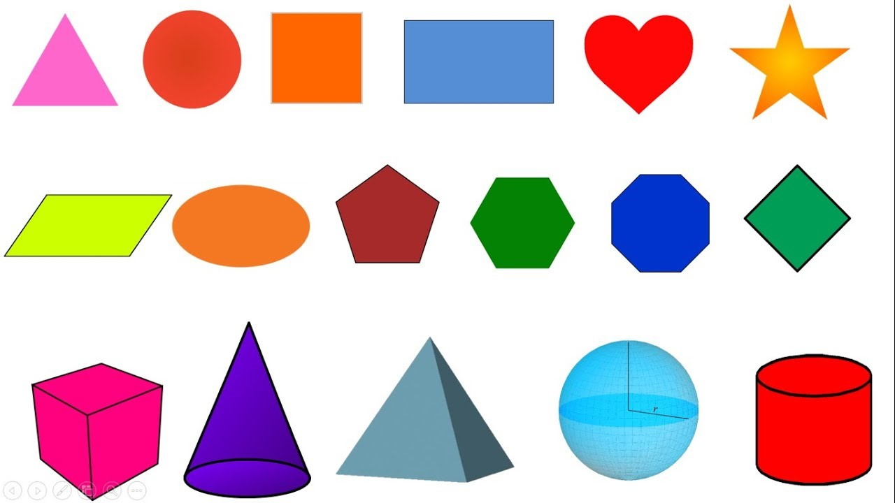

# Đồ họa con Rùa

## 1. Giới Thiệu về Turtle Graphics

**Turtle Graphics** là một mô-đun đồ họa chuẩn trong Python, được sử dụng để vẽ các hình ảnh và hình học đơn giản. Mô-đun này rất hữu ích trong việc học lập trình và minh họa các thuật toán hình học.

## 2. Cài Đặt Turtle Graphics

Mô-đun Turtle là một phần của thư viện chuẩn Python, vì vậy bạn không cần phải cài đặt thêm gì cả. Bạn chỉ cần import nó vào chương trình của mình:

```python
import turtle
```

## 3. Các Lệnh Cơ Bản của Turtle

Dưới đây là bảng phân nhóm các lệnh của thư viện `turtle` kèm theo giải thích bằng tiếng Việt và các tham số của từng hàm, lấy từ tài liệu [turtle — Turtle graphics — Python 3.12.4 documentation](https://docs.python.org/3/library/turtle.html#turtle-methods).

### Turtle Methods

#### Turtle Motion

- **Move and Draw**
  - `forward(distance) | fd(distance)`: Di chuyển rùa về phía trước một khoảng cách nhất định.
    - `distance`: Khoảng cách để rùa di chuyển về phía trước.
  - `backward(distance) | bk(distance) | back(distance)`: Di chuyển rùa lùi về phía sau một khoảng cách nhất định.
    - `distance`: Khoảng cách để rùa di chuyển về phía sau.
  - `right(angle) | rt(angle)`: Xoay rùa sang phải một góc nhất định.
    - `angle`: Góc xoay (độ).
  - `left(angle) | lt(angle)`: Xoay rùa sang trái một góc nhất định.
    - `angle`: Góc xoay (độ).
  - `goto(x, y) | setpos(x, y) | setposition(x, y)`: Di chuyển rùa đến vị trí (x, y) xác định.
    - `x`: Tọa độ x của vị trí đích.
    - `y`: Tọa độ y của vị trí đích.
  - `teleport(x, y)`: Dịch chuyển rùa tức thời đến vị trí mới mà không vẽ đường.
    - `x`: Tọa độ x của vị trí đích.
    - `y`: Tọa độ y của vị trí đích.
  - `setx(x)`: Đặt tọa độ x của rùa.
    - `x`: Tọa độ x mới của rùa.
  - `sety(y)`: Đặt tọa độ y của rùa.
    - `y`: Tọa độ y mới của rùa.
  - `setheading(to_angle) | seth(to_angle)`: Đặt hướng của rùa.
    - `to_angle`: Góc hướng mới của rùa (độ).
  - `home()`: Đưa rùa về vị trí gốc (0, 0) và đặt hướng về phía đông.
  - `circle(radius, extent=None, steps=None)`: Vẽ một hình tròn với bán kính xác định.
    - `radius`: Bán kính của hình tròn.
    - `extent`: (Tùy chọn) Góc cung của hình tròn (độ).
    - `steps`: (Tùy chọn) Số bước để vẽ hình đa giác gần đúng.
  - `dot(size=None, *color)`: Vẽ một chấm tròn tại vị trí hiện tại của rùa.
    - `size`: (Tùy chọn) Kích thước của chấm tròn.
    - `color`: (Tùy chọn) Màu của chấm tròn.
  - `stamp()`: Đóng dấu hình rùa tại vị trí hiện tại.
  - `clearstamp(stampid)`: Xóa một dấu đã được đóng.
    - `stampid`: ID của dấu cần xóa.
  - `clearstamps(n=None)`: Xóa tất cả các dấu đã được đóng hoặc n dấu gần đây nhất.
    - `n`: (Tùy chọn) Số lượng dấu cần xóa.
  - `undo()`: Hoàn tác hành động cuối cùng.
  - `speed(speed=None)`: Đặt tốc độ di chuyển của rùa.
    - `speed`: (Tùy chọn) Tốc độ mới của rùa (0-10).

#### Tell Turtle’s State

- **Position and Orientation**
  - `position() | pos()`: Trả về tọa độ hiện tại của rùa.
  - `towards(x, y=None)`: Tính toán góc để rùa quay về một vị trí xác định.
    - `x`: Tọa độ x của vị trí đích hoặc một cặp tọa độ (x, y).
    - `y`: (Tùy chọn) Tọa độ y của vị trí đích.
  - `xcor()`: Trả về tọa độ x hiện tại của rùa.
  - `ycor()`: Trả về tọa độ y hiện tại của rùa.
  - `heading()`: Trả về hướng hiện tại của rùa (độ).
  - `distance(x, y=None)`: Tính khoảng cách từ vị trí hiện tại của rùa đến một điểm xác định.
    - `x`: Tọa độ x của vị trí đích hoặc một cặp tọa độ (x, y).
    - `y`: (Tùy chọn) Tọa độ y của vị trí đích.

#### Settings and Measurement

- **Unit Settings**
  - `degrees(fullcircle=360.0)`: Đặt đơn vị đo góc là độ.
    - `fullcircle`: (Tùy chọn) Độ của một vòng tròn đầy đủ.
  - `radians()`: Đặt đơn vị đo góc là radian.

#### Pen Control

- **Drawing State**

  - `pendown() | pd() | down()`: Đặt bút xuống để bắt đầu vẽ.
  - `penup() | pu() | up()`: Nhấc bút lên để ngừng vẽ.
  - `pensize(width=None) | width(width=None)`: Đặt độ rộng của nét vẽ.
    - `width`: (Tùy chọn) Độ rộng mới của nét vẽ.
  - `pen(pen=None, **pendict)`: Trả về hoặc đặt các thuộc tính của bút.
    - `pen`: (Tùy chọn) Từ điển chứa các thuộc tính bút mới.
    - `pendict`: (Tùy chọn) Các thuộc tính bút khác.
  - `isdown()`: Kiểm tra xem bút có đang ở trạng thái vẽ hay không.

- **Color Control**

  - `color(*args)`: Đặt màu của bút và màu tô.
    - `args`: Màu sắc cho bút và màu tô (có thể là tên màu hoặc mã màu).
  - `pencolor(*args)`: Đặt màu của bút.
    - `args`: Màu sắc cho bút (có thể là tên màu hoặc mã màu).
  - `fillcolor(*args)`: Đặt màu tô.
    - `args`: Màu sắc cho màu tô (có thể là tên màu hoặc mã màu).

- **Filling**

  - `filling()`: Kiểm tra xem rùa có đang ở trạng thái tô màu hay không.
  - `begin_fill()`: Bắt đầu một vùng để tô màu.
  - `end_fill()`: Kết thúc và tô màu vùng đã xác định.

- **More Drawing Control**
  - `reset()`: Đặt lại rùa về trạng thái ban đầu và xóa toàn bộ bản vẽ.
  - `clear()`: Xóa toàn bộ bản vẽ nhưng giữ nguyên trạng thái của rùa.
  - `write(arg, move=False, align='left', font=('Arial', 8, 'normal'))`: Viết văn bản tại vị trí hiện tại của rùa.
    - `arg`: Văn bản cần viết.
    - `move`: (Tùy chọn) Di chuyển rùa sau khi viết.
    - `align`: (Tùy chọn) Căn chỉnh văn bản ('left', 'center' hoặc 'right').
    - `font`: (Tùy chọn) Bộ ba chứa tên phông chữ, kích thước và kiểu phông chữ.

#### Turtle State

- **Visibility**

  - `showturtle() | st()`: Hiển thị rùa.
  - `hideturtle() | ht()`: Ẩn rùa.
  - `isvisible()`: Kiểm tra xem rùa có đang được hiển thị hay không.

- **Appearance**
  - `shape(name=None)`: Đặt hình dạng của rùa.
    - `name`: (Tùy chọn) Tên của hình dạng mới.
  - `resizemode(rmode=None)`: Đặt chế độ thay đổi kích thước hình rùa.
    - `rmode`: (Tùy chọn) Chế độ thay đổi kích thước ('auto', 'user', 'noresize').
  - `shapesize(stretch_wid=None, stretch_len=None, outline=None) | turtlesize(stretch_wid=None, stretch_len=None, outline=None)`: Đặt kích thước hình rùa.
    - `stretch_wid`: (Tùy chọn) Hệ số kéo dãn chiều rộng.
    - `stretch_len`: (Tùy chọn) Hệ số kéo dãn chiều dài.
    - `outline`: (Tùy chọn) Độ rộng của viền ngoài.
  - `shearfactor(shear=None)`: Đặt hệ số biến dạng của rùa.
    - `shear`: (Tùy chọn) Hệ số biến dạng.
  - `settiltangle(angle)`: Đặt góc nghiêng của rùa.
    - `angle`: Góc nghiêng mới của rùa (độ).
  - `tiltangle()`: Trả về góc nghiêng của rùa.
  - `tilt(angle)`: Nghiêng rùa một góc nhất định.
    - `angle`: Góc nghiêng (độ).
  - `shapetransform(t11=None, t12=None, t21=None, t22=None)`: Đặt phép biến hình của rùa.
    - `t11, t12, t21, t22`: Các tham số của ma trận biến hình.
  - `get_shapepoly()`: Trả về hình đa giác của rùa.

#### Using Events

- **Mouse and Keyboard Events**
  - `onclick(fun, btn=1, add=None)`: Đăng ký một hàm xử lý sự kiện click chuột.
    - `fun`: Hàm xử lý sự kiện.
    - `btn`: (Tùy chọn) Số nút chuột.
    - `add`: (Tùy chọn) Nếu đúng, thêm hàm mới vào danh sách các hàm hiện có.
  - `onrelease(fun, btn=1, add=None)`: Đăng ký một hàm xử lý sự kiện thả chuột.
    - `fun`: Hàm xử lý sự kiện.
    - `btn`: (Tùy chọn) Số nút chuột.
    - `add`: (Tùy chọn) Nếu đúng, thêm hàm mới vào danh sách các hàm hiện có.
  - `ondrag(fun, btn=1, add=None)`: Đăng ký một hàm xử lý sự kiện kéo chuột.
    - `fun`: Hàm xử lý sự kiện.
    - `btn`: (Tùy chọn) Số nút chuột.
    - `add`: (Tùy chọn) Nếu đúng, thêm hàm mới vào danh sách các hàm hiện có.

#### Special Turtle Methods

- **Polygon Handling**
  - `begin_poly()`: Bắt đầu ghi lại hình đa giác.
  - `end_poly()`: Kết thúc ghi lại hình đa giác.
  - `get_poly()`: Trả về hình đa giác đã ghi lại.
  - `clone()`: Tạo một bản sao của rùa.
  - `getturtle() | getpen()`: Trả về chính đối tượng rùa.
  - `getscreen()`: Trả về đối tượng màn hình mà rùa đang vẽ trên đó.
  - `setundobuffer(size)`: Đặt kích thước bộ đệm hoàn tác.
    - `size`: Kích thước bộ đệm.
  - `undobufferentries()`: Trả về số lượng mục trong bộ đệm hoàn tác.

### Methods of TurtleScreen/Screen

#### Window Control

- **Background and Screen Settings**
  - `bgcolor(*args)`: Đặt màu nền của màn hình.
    - `args`: Màu sắc nền (có thể là tên màu hoặc mã màu).
  - `bgpic(picname=None)`: Đặt hình nền của màn hình.
    - `picname`: (Tùy chọn) Tên của hình nền.
  - `clearscreen()`: Xóa toàn bộ màn hình.
  - `resetscreen()`: Đặt lại màn hình về trạng thái ban đầu.
  - `screensize(canvwidth=None, canvheight=None, bg=None)`: Đặt kích thước của màn hình.
    - `canvwidth`: (Tùy chọn) Chiều rộng canvas.
    - `canvheight`: (Tùy chọn) Chiều cao canvas.
    - `bg`: (Tùy chọn) Màu nền.
  - `setworldcoordinates(llx, lly, urx, ury)`: Đặt tọa độ thế giới cho màn hình.
    - `llx`: Tọa độ x của góc dưới bên trái.
    - `lly`: Tọa độ y của góc dưới bên trái.
    - `urx`: Tọa độ x của góc trên bên phải.
    - `ury`: Tọa độ y của góc trên bên phải.

#### Animation Control

- **Animation Settings**
  - `delay(delay=None)`: Đặt độ trễ của hoạt hình.
    - `delay`: (Tùy chọn) Độ trễ (ms).
  - `tracer(n=None, delay=None)`: Đặt số bước vẽ sẽ được bỏ qua để tăng tốc độ vẽ.
    - `n`: (Tùy chọn) Số bước vẽ.
    - `delay`: (Tùy chọn) Độ trễ (ms).
  - `update()`: Cập nhật màn hình với các thay đổi vẽ.

#### Using Screen Events

- **Event Listeners**
  - `listen(xdummy=None, ydummy=None)`: Đặt màn hình vào chế độ lắng nghe sự kiện.
  - `onkey(fun, key) | onkeyrelease(fun, key)`: Đăng ký một hàm xử lý sự kiện nhấn/phát hành phím.
    - `fun`: Hàm xử lý sự kiện.
    - `key`: Phím cần lắng nghe.
  - `onkeypress(fun, key=None)`: Đăng ký một hàm xử lý sự kiện nhấn phím.
    - `fun`: Hàm xử lý sự kiện.
    - `key`: (Tùy chọn) Phím cần lắng nghe.
  - `onclick(fun, btn=1, add=None) | onscreenclick(fun, btn=1, add=None)`: Đăng ký một hàm xử lý sự kiện click chuột trên màn hình.
    - `fun`: Hàm xử lý sự kiện.
    - `btn`: (Tùy chọn) Số nút chuột.
    - `add`: (Tùy chọn) Nếu đúng, thêm hàm mới vào danh sách các hàm hiện có.
  - `ontimer(fun, t)`: Đăng ký một hàm xử lý sự kiện hẹn giờ.
    - `fun`: Hàm xử lý sự kiện.
    - `t`: Thời gian đợi (ms).
  - `mainloop() | done()`: Bắt đầu vòng lặp chính của chương trình.

#### Settings and Special Methods

- **Screen Mode and Shape Management**
  - `mode(mode=None)`: Đặt chế độ màn hình.
    - `mode`: (Tùy chọn) Chế độ mới ('standard', 'logo', 'world').
  - `colormode(cmode=None)`: Đặt chế độ màu.
    - `cmode`: (Tùy chọn) Chế độ màu (1.0 hoặc 255).
  - `getcanvas()`: Trả về đối tượng canvas của màn hình.
  - `getshapes()`: Trả về danh sách các hình dạng có sẵn.
  - `register_shape(name, shape=None) | addshape(name, shape=None)`: Đăng ký một hình dạng mới.
    - `name`: Tên của hình dạng mới.
    - `shape`: (Tùy chọn) Hình dạng (có thể là tệp hình ảnh hoặc danh sách các điểm).
  - `turtles()`: Trả về danh sách các rùa trên màn hình.
  - `window_height()`: Trả về chiều cao cửa sổ.
  - `window_width()`: Trả về chiều rộng cửa sổ.

#### Input Methods

- **User Input**
  - `textinput(title, prompt)`: Hiển thị hộp thoại nhập văn bản từ người dùng.
    - `title`: Tiêu đề của hộp thoại.
    - `prompt`: Lời nhắc cho người dùng.
  - `numinput(title, prompt, default=None, minval=None, maxval=None)`: Hiển thị hộp thoại nhập số từ người dùng.
    - `title`: Tiêu đề của hộp thoại.
    - `prompt`: Lời nhắc cho người dùng.
    - `default`: (Tùy chọn) Giá trị mặc định.
    - `minval`: (Tùy chọn) Giá trị nhỏ nhất.
    - `maxval`: (Tùy chọn) Giá trị lớn nhất.

#### Methods Specific to Screen

- **Screen Specific**
  - `bye()`: Đóng cửa sổ màn hình.
  - `exitonclick()`: Đóng cửa sổ màn hình khi người dùng click chuột.
  - `setup(width=0.5, height=0.75, startx=None, starty=None)`: Đặt kích thước và vị trí của cửa sổ màn hình.
    - `width`: (Tùy chọn) Chiều rộng của cửa sổ.
    - `height`: (Tùy chọn) Chiều cao của cửa sổ.
    - `startx`: (Tùy chọn) Vị trí x của cửa sổ.
    - `starty`: (Tùy chọn) Vị trí y của cửa sổ.
  - `title(titlestring)`: Đặt tiêu đề của cửa sổ màn hình.
    - `titlestring`: Tiêu đề mới.

Bạn có thể truy cập danh sách đầy đủ các lệnh và mô tả chi tiết từ đường dẫn tài liệu chính thức: [turtle — Turtle graphics — Python 3.12.4 documentation](https://docs.python.org/3/library/turtle.html#turtle-methods).

Cách vẽ một số hình cơ bản:

### Tạo và Hiển Thị Cửa Sổ Vẽ

```python
# Tạo một đối tượng Turtle
t = turtle.Turtle()

# Hiển thị cửa sổ vẽ
turtle.done()
```

### Di Chuyển Turtle

```python
# Tạo một đối tượng Turtle
t = turtle.Turtle()

# Di chuyển turtle về phía trước 100 đơn vị
t.forward(100)

# Quay trái 90 độ
t.left(90)

# Di chuyển turtle về phía trước 50 đơn vị
t.forward(50)

# Hiển thị cửa sổ vẽ
turtle.done()
```

### Các Lệnh Di Chuyển Khác

- `t.backward(distance)`: Di chuyển turtle về phía sau `distance` đơn vị.
- `t.right(angle)`: Quay turtle sang phải một góc `angle` độ.
- `t.goto(x, y)`: Di chuyển turtle đến tọa độ `(x, y)`.

## 4. Vẽ Hình Học Cơ Bản

### Vẽ Hình Vuông

```python
t = turtle.Turtle()

for _ in range(4):
    t.forward(100)
    t.right(90)

turtle.done()
```

### Vẽ Hình Tam Giác

```python
t = turtle.Turtle()

for _ in range(3):
    t.forward(100)
    t.left(120)

turtle.done()
```

### Vẽ Hình Tròn

```python
t = turtle.Turtle()

# Vẽ hình tròn với bán kính 50 đơn vị
t.circle(50)

turtle.done()
```

## 5. Tùy Chỉnh Turtle

### Thay Đổi Màu Sắc

```python
t = turtle.Turtle()

# Thay đổi màu viền (màu bút)
t.pencolor("blue")

# Thay đổi màu tô (màu nền bên trong hình)
t.fillcolor("red")

# Bắt đầu tô màu
t.begin_fill()

for _ in range(4):
    t.forward(100)
    t.right(90)

# Kết thúc tô màu
t.end_fill()

turtle.done()
```

### Thay Đổi Độ Dày Nét Vẽ

```python
t = turtle.Turtle()

# Thay đổi độ dày nét vẽ
t.pensize(5)

t.forward(100)

turtle.done()
```

### Ẩn và Hiện Turtle

```python
t = turtle.Turtle()

# Ẩn turtle
t.hideturtle()

t.forward(100)

# Hiện turtle
t.showturtle()

turtle.done()
```

## 6. Vẽ Hình Phức Tạp

### Vẽ Ngôi Sao

```python
t = turtle.Turtle()

for _ in range(5):
    t.forward(100)
    t.right(144)

turtle.done()
```

### Vẽ Bông Hoa

```python
t = turtle.Turtle()

t.pencolor("red")

for _ in range(36):
    t.forward(100)
    t.right(170)

turtle.done()
```

## Thực hành

Vẽ những hình học cơ bản sau


