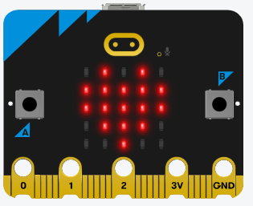
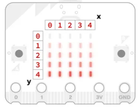
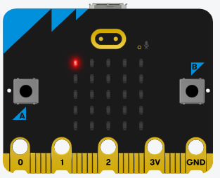

# Display - Hiển thị

Tài liệu lập trình Python cho Microbit: https://microbit-micropython.readthedocs.io/en/v2-docs/ 


## 💛 Giới thiệu về Mirobit

### 🔥 Mirobit là gì ?

Microbit là một chương trình học lập trình trực quan theo hình thức kéo thả tương tự như Scratch cho các bạn nhỏ từ 6 - 17 tuổi.

Trang web chính thức: https://microbit.org

Được quỷ giáo dục có tên `Micro:bit Educational Foundation` khởi xướng.

Nhằm khơi dậy niếm đam mê lập trình trong thời đại số.

### 🔥 Giới thiệu bộ kit Zoombit

`Zoombit` là một bộ kit dưới dạng xe robot. Có sử dụng bo mạch `micro:bit` để lập trình và điều khiển.

==================================

## 💛 Trình biên soạn Code

### 🔥 App micro:bit Python Editor

Phần mêm chạy trên trình duyệt: https://python.microbit.org

### 🔥 Giới thiệu micro:bit Python Editor

Hướng dẫn sử dụng: 

- https://microbit.org/get-started/user-guide/python-editor/
- https://support.microbit.org/support/solutions/articles/19000135210

==================================

## 💛 Display - Hiển thị


### 🔥 Giới thiệu Đèn LED micro:bit



- Micro:bit được trang bị một hệ thống LED 5x5
- Bạn có thể hiển thị: Chữ, Số, Icon với các điểm ảnh lên đó
- Dưới mỗi bóng LED có chứa cảm biến ánh sáng.

### 🔥 Câu lệnh hiển thị (OUTPUT)

Chi tiết: https://python.microbit.org/v/3/reference/display


### Hàm `display.show()`

Hiển thị: chữ, số, icon

```python
# Import Module microbit ở đầu tập tin 
from microbit import *

# Hiển thị chữ
display.show('score')
# Hiển thị số
display.show(23)
# Hiển thị Hình ảnh
display.show(Image.ASLEEP)
```

Trong đó đối tượng `Image` được định nghĩa sẵn một số kiểu hình ảnh.

Bạn có thể tìm thấy danh sách đó ở tab API-->Microbit-->Image


### Hàm `display.scroll()`

Hàm này cách dùng giống như `display.show()` tuy nhiên khác ở chỗ là nó có hiệu ứng chạy dịch phải --> trái 1 lần 1 đèn LED

```python
# Import Module microbit ở đầu tập tin 
from microbit import *

# Hiển thị chữ
display.scroll('score')
# Hiển thị số
display.scroll(23)
```


### Hàm `sleep(milisecned)`

Hàm này để deplay thực thi một câu lệnh phía sau nó.

Ví dụ

```python
from microbit import *

display.show('score')
sleep(400) # 400 mili giây
display.show(23)
```

Được hiểu là :

- Chạy câu lệnh: `display.show('score')`
- Dừng lại `400` mili giây
- Chạy tiếp: `display.show(23)`


### Hàm `display.clear()`

Để xóa hết những gì hiển thị lên LED. Hay còn gọi là tắt hết các đèn LED.


### Hàm `display.set_pixel(x,y,z)`

Hàm này dũng điều khiển cụ thể bất kỳ đèn LED nào trên bo mạch mico:bit.

Theo tọa độ như hình dưới đây



Hàm `display.set_pixel(x,y,z)` nhận vào 3 tham số

- x: là tọa độ theo trục x
- y: là tọa độ theo trục y
- z: là độ sáng của bóng LED tăng dần từ 0 - 9

Ví dụ:

```python
display.set_pixel(0,0,9)
```

Kết quả: Đèn ở tọa độ 0, 0 sẽ sáng mức cao nhất



---

## 💛 THỰC HÀNH


### Task 1: Trình diễn pháo hoa

Tạo chương trình

- Đếm ngược 3-2-1
- Hiển thị hiệu ứng pháp hoa từ nhỏ đến lớn


### Task 2: Tín hiệu giao thông

Quy ước:

-  `Image.YES` là đèn Xanh
-  `Image.NO` là đèn Đỏ

Bạn hãy tạo ra mô phỏng cột Đèn Đỏ ở thực tế. 

- Mặc định hiển thị lên lúc đầu là `Đèn Đỏ`, 
- Sau đó đếm ngược 10 giây thì chuyển sang `Đèn Xanh`.

Hãy lập trình theo mô tả trên và nạp chương trình vào bo mạch mico:bit.


