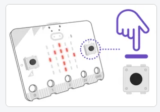

# Inputs - Đầu vào

Trong bài này chúng ta tìm hiểu các giá trị đầu vào để xử lý

## 💛 Buttons - Các nút nhấn

Xem chi tiết tại: https://python.microbit.org/v/3/reference

Trên bo mạch micro:bit có chứa 2 nút nhấn A, B, và một biểu tượng Logo. Bạn có thể lập trình cho các Nút này để thực hiện các hành động theo ý muốn.




Bạn sẽ code như sau

```python
from microbit import *

while True:
    # 🔥 Nếu phím A đang được nhấn (Tiếp diễn)
    if button_a.is_pressed(): 
        display.scroll('A is') # Hiện thị chữ A
    
    # 🔥 Nếu phím A đã được nhấn trước đó. (Quá khứ)
    if button_a.was_pressed(): 
        display.scroll('A was') # Hiện thị chữ A

    # 🔥 Nếu phím B đang được nhấn (Tiếp diễn)
    if button_b.is_pressed(): 
        display.scroll('B is') # Hiện thị chữ B

    # 🔥 Nếu phím B đã được nhấn trước đó. (Quá khứ)
    if button_b.was_pressed(): 
        display.scroll('B was') # Hiện thị chữ B

    #🔥 Đang nhấn A+B cùng lúc (Tiếp diễn)
    if button_b.is_pressed() and button_b.is_pressed():
        display.scroll('AB pressed')
```

Dùng vòng lặp while, với biểu thức điều kiện luôn là `True` để sẵn sàng thực hiện câu lệnh bên trong khối if, khi phím A được nhấn.


### 🔥 Chạm Logo

Xem chi tiết tại: https://python.microbit.org/v/3/reference/touch-logo

Khi chạm vào logo thì làm gì đó

```python
from microbit import *

while True:
    if pin_logo.is_touched():
        display.show(Image.HAPPY)
```

## 💛 Sensors - Cảm biến

Ngoài các tương tác vật lý trên. Bạn có thể sử dụng các cảm biến, dựa vào các chỉ số cảm biến mà bạn đưa ra những hành động tương ứng.

### 🔥 Cảm biến con lắc hồi quy

Xem chi tiết tại: https://python.microbit.org/v/3/reference/accelerometer

Bạn có thể tương tác: Lắc, xoay, ... bo mạch micro:bit theo các hướng khác nhau.

```python
from microbit import *

while True:
    if accelerometer.was_gesture('face down'):
        display.show(Image.ASLEEP)
```

Trong đó hàm `accelerometer.was_gesture(str)` nhận vào tham số với các giá trị

- `shake`: lắc
- `up`: hướng logo lên trên theo trục thẳng đứng
- `down`: hướng logo xuống dưới theo trục thẳng đứng
- `face up`: Đưa mặt có logo lên trên theo phương ngang
- `face down`:  Đưa mặt có logo lên úp xuống theo phương ngang
- `left`: nghiêng qua trái
- `right`: nghiêng qua phải

Dựa vào đó bạn có thể thực hiện các hàng động tương tứng


### 🔥 Cảm biến nhiệt độ

Xem chi tiết tại: https://python.microbit.org/v/3/reference/temperature

Để lấy thông số cảm biến nhiệt độ đo được

```python
from microbit import *
# Lấy nhiệt độ từ hàm temperature trả về
temp = temperature()
# Hiển thị lên LED
display.scroll(temp)
```


### 🔥 Cảm biến ánh sáng


Xem chi tiết tại: https://python.microbit.org/v/3/reference/light-level

Để lấy thông số cường độ ánh sáng đo được

```python
from microbit import *
# Lấy nhiệt độ từ hàm temperature trả về
light_level = display.read_light_level()
# Hiển thị lên LED
display.scroll(light_level)
```

---

## 💛 THỰC HÀNH

Sử dụng trình giả lập Simulator bên phải để làm những nhiệm vụ sau

### 🔥 Task 1

Tạo một Project mới đặt tên là `simpleInputs` lập trình các hành động sau:

- Nhấn button A thì hiển thị mặt cười.
- Nhấn button B thì hiển thị mặt buồn.
- Lắc micro:bit hiển thị hình con vịt ra màn hình LED
- Chạm vào Logo hiển thị hình conhươu cao cổ

### 🔥 Task 2

Tạo một Project mới đặt tên là `playBirthday` lập trình các hành động sau:

- Hiển thị hình trái tim
- Khi nhấn nút A
  - Hiển thị đếm ngược 3-2-1
  - Phát giai điệu nhạc chúc mừng sinh nhật. 

```python
# Import lên đầu
import music

#Phát giai điệu
music.play(music.BIRTHDAY)
```


### 🔥 Task 3

Lập trình hiển thị kết quả của các phép tính 2 số.

- Cho biến x = 10, y = 5
- Khi nhấn phím A, hiển thị kết quả phép tính ` Tổng` ra màn hình LED
- Khi nhấn phím A, hiển thị kết quả phép tính ` Nhân`ra màn hình LED
- Khi nhấn phím A, hiển thị kết quả phép tính ` Chia`ra màn hình LED


### 🔥 Task 4 - Đèn Cảnh Báo An Toàn

Lucy có một người bạn tên là Jack không may bị tai nạn giao thông và bị thương đôi chân không đi lại được. Bạn ấy phải di chuyển bằng xe lăn. Jack rất thích đi dạo công viên mỗi buổi tối, công viên thì đông người qua lại, có cả những người đi xe đạp

Bạn có thể giúp Jack tạo một đèn cánh báo vào ban đêm để bạn ấy gắn lên xe lăn không ?

- Khi micro:bit bật lên thì hiển thị icon trái tim
- Khi nhấn Button A, micro:bit dựa vào cường độ ánh sáng để nhận biết làm ban đêm để bật LED và tắt LED
  - Nếu là ban đêm thì bật cả 25 đèn LED, rồi tắt bật liên tục để tạo hiệu ứng đèn LED nháy cảnh báo
  - Nếu là ban ngày thì hiển thị biểu tượng mặt trời
- Nhấn button B thì tắt chương
trình

> Lưu ý: Trong đó Nếu cường độ ánh áng > 100 thì là ban ngày.


### 🔥 Task 5 - Điều hòa thông minh

Thời tiết vào mùa Hè rất là nóng, may mắn là nhà của bạn Chaien có điều hòa để làm mát, giúp bạn ấy ngủ ngon giấc hơn.

Tuy nhiên càng về khuya thì Chaien cảm thấy rất là lạnh mà tắt điều hòa luôn thì lại nóng. Bạn có cách nào giúp Chaien giải quyết vấn đề trên hay không ? Vừa bớt lạnh mà lại tiết kiệm điện.

> Dùng micro:bit đo nhiệt độ phòng của Chaien

- Lúc nào nhiệt độ xuống `22 ℃` độ thì tắt điều hòa. Màn hình LED hiển thị hoa tuyết.
- Lúc nào nhiệt độ tăng lên `28 ℃` độ thì bật lại điều hòa. Màn hình LED hiển thị mặt buồn
- Chạm vào Logo thì hiển thị nhiệt độ phòng hiện tại


