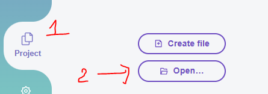
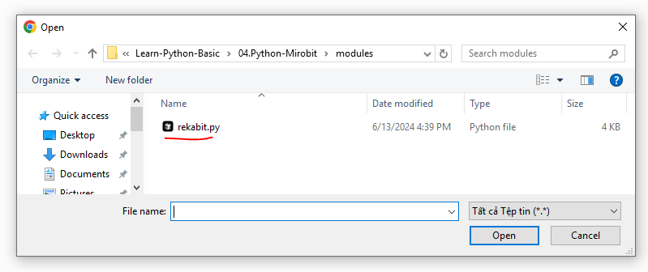
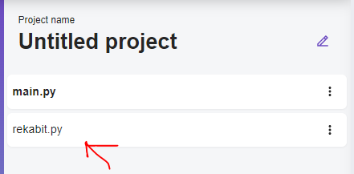
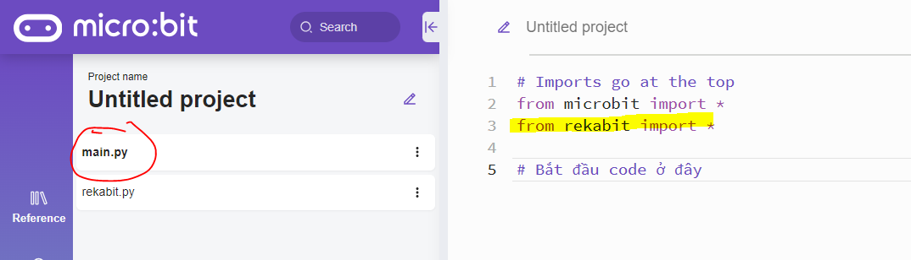
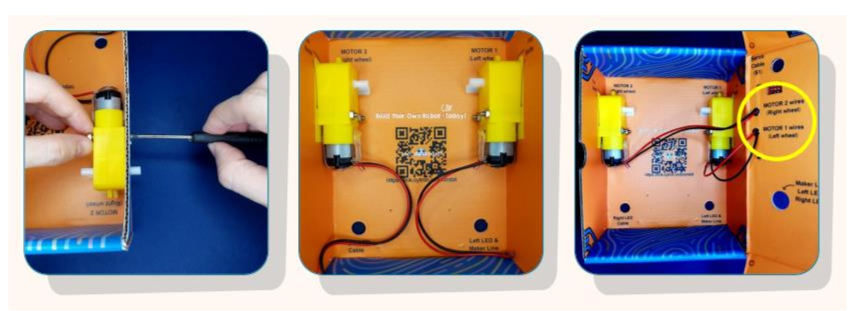
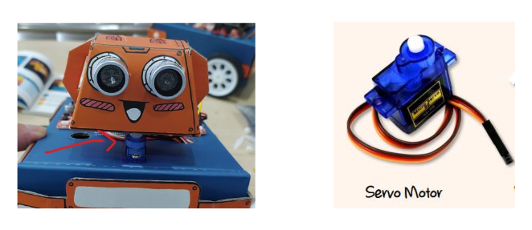
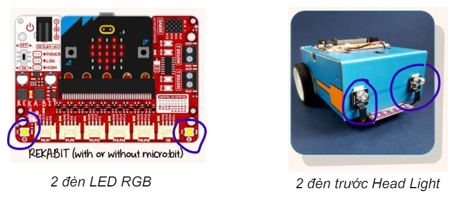

# Run - Điều khiển động cơ

Hiện tại Microbit Python Editor chưa hỗ trợ Module để điều khiển bộ kít xe robot xe Zoombit. Tuy nhiên bạn có thể sử làm theo hướng dẫn sau để tạo module điều khiển.


## 💛 Cài đặt Module Rekabit

Xem tài liệu: https://github.com/Bhavithiran97/micropython-rekabit

**Bước 1**

Tạo một Project mới trong micro:bit Python Editor


**Bước 2 - Thêm Module**

Chọn tab `Project` --> Sau đó click nút `Open`



Sau đó chọn file rekabit.py đã tải về



Sau đó click vào biểu tượng như mục 1. Chọn Mục 2 `Add file rekabit.py`. Tiếp click nút `Confirm`


Project của bạn sẽ có thêm một file `rekabit.py` bên cạnh file `main.py`



Sau đó bạn click vào file `main.py`. Import thêm module `rekabit` như hình dưới đây.




BẮT ĐẦU TÌM HIỂU CÁCH ĐIỀU KHIỂN THÔI !!!

---


## 💛 Động cơ Motor DC

Bộ kit zoom:bit được trang bị 2 động cơ giảm tốc để di chuyển.



Lệnh điều khiển: https://github.com/Bhavithiran97/micropython-rekabit?tab=readme-ov-file#dc-motors


```python
from rekabit import *

while True:
	#Move forward at full speed - Chạy tới
	run_motor(Motor_All, Direction_Forward, speed=255) 
	sleep(1000)
	
	#Move backward at half speed - Chạy lùi
	run_motor(Motor_All, Direction_Backward, speed=128) 
	sleep(1000)
	
	#Turn left at full speed - Rẻ trái
	run_motor(Motor_M1, Direction_Backward, speed=255 )
	run_motor(Motor_M2, Direction_Forward, speed=255 )
	sleep(1000)
	
	#Turn right at half speed - Rẻ phải
	run_motor(Motor_M1, Direction_Forward, speed=128 )
	run_motor(Motor_M2, Direction=Backward, speed=128 )
	sleep(1000)
	
	#Brake both motors - Phanh
	brake_motor(Motor_All)
	sleep(1000)
```


## 💛 Động cơ Servo

Servo Motor là phần động cơ được gắn dưới đầu xe robot zoom:bit. Bạn có thể xoay đầu 180 độ với động cơ này.




Lệnh điều khiển: https://github.com/Bhavithiran97/micropython-rekabit?tab=readme-ov-file#servos


```python
from rekabit import *

while True:
	#Disable all servo when button A and B pressed
	if button_a.is_pressed() and button_b.is_pressed():
		disable_servo(Servo_All)
		
	#Set servo 1 to position 0 degree (min)
	elif button_a.is_pressed():
		sets_servo_position(Servo_S1, position=0 )
		
	#Set servo 1 to position 180 degree (max)
	elif button_b.is_pressed():
		sets_servo_position(Servo_S1, position=180 )
```

## 💛 Đèn Trước



Đang cập nhật...


## 💛 Đèn RGB LED Trên bo mạch REKA:bit

Xem thêm: 

- https://github.com/Bhavithiran97/micropython-rekabit?tab=readme-ov-file#neopixel
- https://microbit-micropython.readthedocs.io/en/latest/neopixel.html

Cách điều khiển:

```python
from rekabit import *
import neopixel

np = neopixel.NeoPixel(pin8, 2)
```

Hiển thị 2 LED cùng 1 màu

```python
for LED in range(2):
	np[LED] = (255,0,0)
np.show()
```

Hiển thị mỗi LED mỗi màu riêng


```python
np[0]= 255,0,0    #red
np[1]= 255,255,0  #yellow
np.show()
```

Tắt tất cả LED

```python
np.clear()
```

Một số màu cơ bản theo hệ RGB:

- **Red**: `rgb(255, 0, 0)` 
- **Orange**: `rgb(255, 164, 0)` 
- **Yellow**: `rgb(255, 255, 0)` 
- **Green**: `rgb(0, 255, 0)` 
- **Blue**: `rgb(0, 0, 255)` 
- **Indigo**: `rgb(75, 0, 130)` 
- **Violet**: `rgb(138, 43, 226)` 
- **Purple**: `rgb(255, 0, 255)` 
- **White**: `rgb(255, 255, 255)` 
- **Black**: `rgb(0, 0, 0)` 


## 💛 Điều khiển qua sóng Radio

Xem tài liệu: https://python.microbit.org/v/3/reference/radio

Để điều khiển xe Zoom:bit bạn cần 2 micro:bit

- 1 Cái đề gửi tín hiệu
- 1 Cái để nhận tín hiệu và thực thi hành động tương tứng với tín hiệu.

### 🔥 Gửi tín hiệu Radio

```python
from microbit import *
import radio

# Cấu hình nhóm cho 2 micro:bit. Cùng Kênh tần số
radio.config(group=1)
# Bật radio
radio.on()

# Gửi tín hiệu
radio.send('hello') # Gửi tín hiệu chữ
radio.send(88) # Gửi tín hiệu số
```


### 🔥 Nhận tín hiệu Radio

```python
from microbit import *
import radio

# Cấu hình nhóm cùng nhóm với micro:bit gửi
radio.config(group=1)
# Bật radio
radio.on()
# Nhận tín hiệu
while True: # Dùng vòng lặp while để luôn lắng nghe tín hiệu
    message = radio.receive() # nhận tín hiệu
    # Thực hiện các hành động theo tín hiệu nhận được
    if message == 'hello':
      display.scroll("Xin chào")
    elif message == 88:
      display.scroll("88")
```

## 💛 THỰC HÀNH

### 🔥 Task 1 - Xe cảnh sát zoom:bit

Sử dụng zoom:bit giả làm một xe cảnh sát với yêu cầu chương trình như sau:

- Khởi động lên:
  - thì cho Servo xoay đầu phía trước
  - Màn hình LED hiển thị mặt cười. Bật âm thanh power up
  - Đèn trước tự động sáng khi trời tối
- Nhấn button A:
  -  đầu xoay phải,
  - màn hình LED hiển thị mũi trên hướng phải
- Nhấn button B:
  - đầu xoay trái 
  - màn hình LED hiển thị mũi trên hướng trái
- Nhấn button A+B:
  - đầu xoay ra trước
  - màn hình LED hiển thị mũi trên hướng lên
- Chạm Logo:
  -  đầu xoay ra trước
  - màn hình LED hiển thị mũi trên hướng xuống

Ngoài ra:

Để tăng sự thu hút của mọi người
và nhường đường để xe chạy, bạn
có thể vừa cho đèn RGB LED nhấp
nháy liên tục 2 màu Xanh Đỏ vừa
phát ra tiếng còi báo động bằng các
khối âm thanh


### 🔥 Task 2 - Điều khiển xe với Radio

Cũng với cách lập trình trên, nhưng sử dụng 2 micobit
- 1 Cái gửi tín hiệu 
  - Nhấn A, thì gửi đi chữ `right`
  - Nhấn B, thì gửi đi chữ `left`
  - Nhấn A+B, thì gửi đi chữ `backward`
  - Nhấn Logo, thì gửi đi chữ `forward`
- 1 Cái nhận tín hiệu
  - Khi nhận được chữ `right`:
    -  đầu xoay phải,
    - màn hình LED hiển thị mũi trên hướng phải
  - Nhấn B, thì gửi đi chữ `left`
    - đầu xoay trái 
    - màn hình LED hiển thị mũi trên hướng trái
  - Nhấn A+B, thì gửi đi chữ `backward`
    - đầu xoay ra trước
    - màn hình LED hiển thị mũi trên hướng lên
  - Nhấn Logo, thì gửi đi chữ `forward`
    -  đầu xoay ra trước
    - màn hình LED hiển thị mũi trên hướng xuống